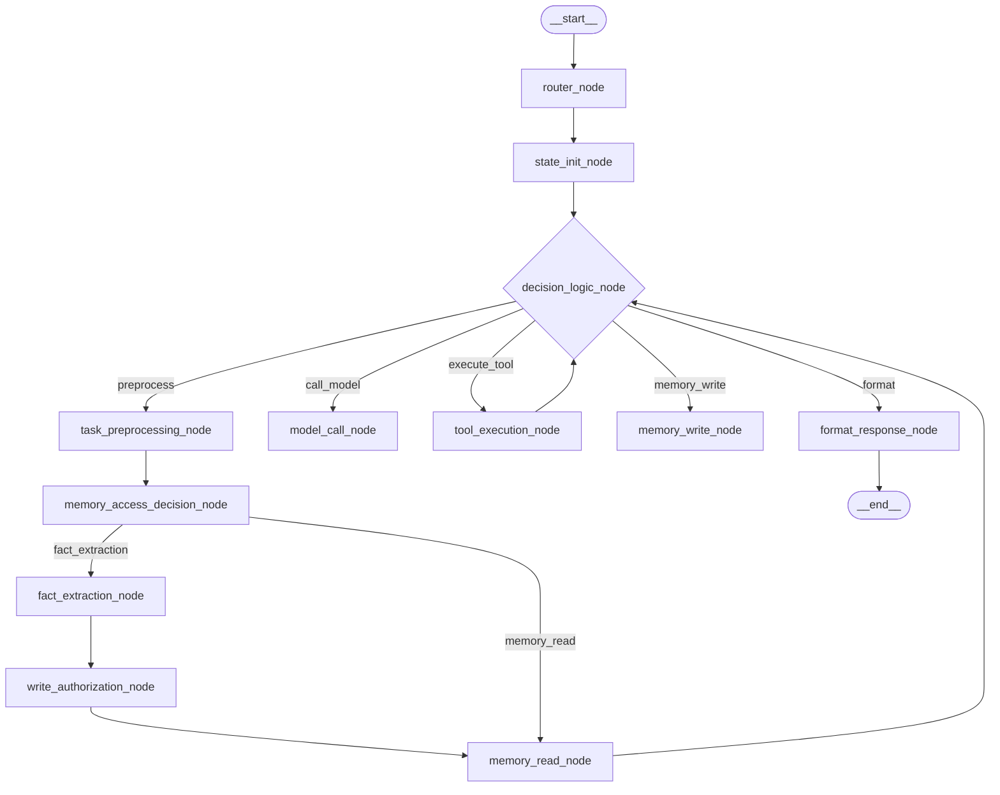

# SAM-Agent Architecture (Telegram Edition)

This document describes the advanced architectural design of the Stateful Agent Model (SAM) with Telegram integration, MCP, and DMA.

## 🗺️ System Overview

SAM-Agent uses a highly sophisticated LangGraph DAG that incorporates deterministic preprocessing and tool-calling capabilities.

## 🧠 Core Components

### 1. Orchestrator (`agent/langgraph_orchestrator.py`)
A 1500+ line LangGraph implementation managing:
- **Phase MCP**: Model Context Protocol for tool execution (e.g., web search).
- **Phase DMA**: Deterministic Memory Access using regex to detect intent before LLM calls.

### 2. Intelligence Layer (`agent/intelligence/`)
- **`fact_extraction.py`**: Extracts personal facts from input.
- **`guardrails.py`**: Ensures tool calls and outputs stay within safety limits.

### 3. Transport Layer (`transport/`)
- **`telegram/`**: Pure I/O for Telegram messaging.
- **`whatsapp/`**: Pure I/O for WhatsApp messaging.

### 4. Memory System (`agent/memory/`)
- **Short-Term**: SQLite.
- **Long-Term**: Qdrant Vector Store.

## 🔀 Decision Logic
The `decision_logic_node` handles:
- **Pre-model routing**: Deciding if a tool or memory read is needed.
- **Post-model routing**: Managing the memory write cycle before final formatting.

## 🧪 Verification
Run `verify_skeleton.py` to ensure all components and docs are present.
